# Java 高级编程（JavaEE 程序设计与应用开发）期末作业教程

本教程及相关代码由 [@ElaBosak233](https://github.com/elabosak233) 撰写于 2024 学年第一学期，用于给 23 届学生在完成 Java 高级编程期末作业时提供指导。

## 前言

总的来说，我们需要使用本学期学习过的内容（或者尚未学习的内容），完成一个简易的 Blog（博客）后端。学有余力的同学，可以上手现代化前端开发，实现一个更加美观的博客系统。

教程的文字部分只会在前部分于 README.md 文档内详细讲解，至于开发部分，README.md 只会在必要的地方进行讲解，具体的讲解都在源码内。

### 考核

因为本学期学习的是 JavaEE，内容更加偏向后端开发，所以对于前端不做要求。只要完成后端部分，则可获得绝大部分分数，剩下的前端作为加分项。

### 目标

- 能够区分前端和后端
- 能够上手 JakartaEE 技术栈
- 能够使用 Maven 进行包管理、项目构建
- 能够配置 Tomcat 和 IDEA 开发环境
- 能够配置 Hibernate 和 MySQL 连接
- 能够设计项目中需要的实体类
- 能够区分 Controller、Service、Repository（DAO）层
- 能够使用 JWT 进行鉴权与 Token 分发

### 提问的智慧

在开发的过程中，难免会遇到各种各样的问题，如果你遇到了问题，那么首先应该尝试自己解决，因为只有自己解决了问题，你才会真正掌握它。但是，如果你尝试了各种方法都无法解决问题，那么你可以选择向他人寻求帮助。所以在开始之前，我强烈建议你先阅读 [提问的智慧](https://github.com/ryanhanwu/How-To-Ask-Questions-The-Smart-Way/blob/main/README-zh_CN.md) 这篇文章，这会帮助你更好地提问，从而获得你需要的帮助。因为说到底，我也只是一个学生，我没有义务帮你解决所有的问题，如果你能按照提问的智慧来提问，那么我可能会愿意帮你解决你的问题。

## 环境

环境配置是本教程的第一步，也是最重要的步骤。即使你的电脑上可能有 JDK 和 Tomcat，但他们可能不是本项目要求的版本，所以请不要偷懒，按照教程一步一步来，做好环境的配置与检查。

#### 有关网络的说明

由于国内网络问题，本教程中涉及到的某些链接可能无法直接访问，你需要加速器或者科学上网工具（或者说魔法）来访问这些链接，说实在的，没有魔法是真的寸步难行。

但我至少知道，[Watt Toolkit](https://steampp.net/) 可以帮你解决发生在 GitHub 上的大部分网络问题，但如果你需要访问其他网站（Google 或者什么其他的），那么你可能需要自己想办法了，这些内容不能明说。

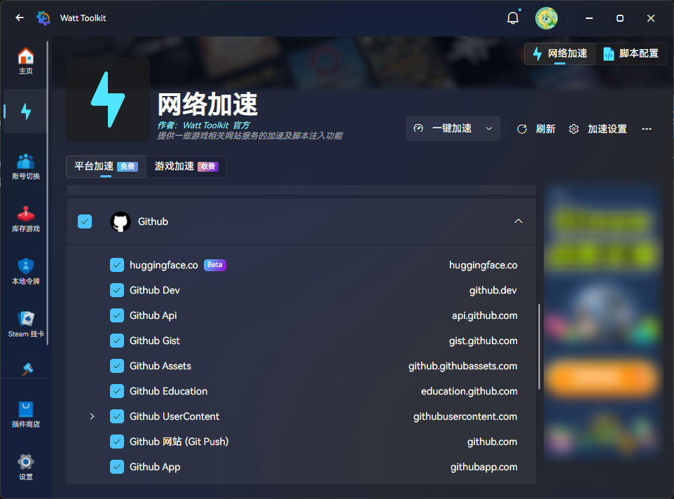

### Java Development Kit 21

使用 Oracle JDK 21 作为 Java 开发环境，你可以从 [Oracle 官方网站](https://www.oracle.com/java/technologies/downloads/#java21) 下载并安装。

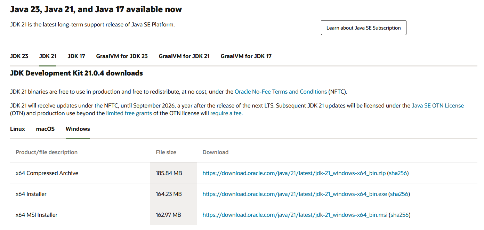

你可以选择下载安装版，也可以选择压缩包版，安装版会自动配置环境变量，而压缩包版需要手动配置。但实际上在使用 IDEA 的情况下，IDEA 内部可以选择使用某个路径下的特定 JDK，所以这里推荐下载压缩包版。

### Apache Tomcat 10

使用 Apache Tomcat 10 作为 Web 服务器，你可以从 [Tomcat 官方网站](https://tomcat.apache.org/download-10.cgi) 下载。

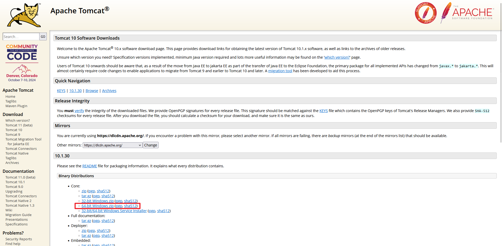

这里下载压缩包即可，无需安装版本的 Tomcat，因为我们的项目使用 IDEA + Maven 构建，所以 Tomcat 的配置将由 IDEA + Maven 完成。

### IntelliJ IDEA Ultimate

我们需要使用最新版（到截稿日的 IDEA 版本为 `2024.2.3`）的 IDEA 作为集成开发环境，你可以从 [IDEA 官方网站](https://www.jetbrains.com/idea/download/) 下载。当然，你也可以使用 JetBrains Toolbox 进行下载，同理 Toolbox 可以从 [Toolbox 官方网站](https://www.jetbrains.com/toolbox-app/) 下载。我比较推荐使用 Toolbox，因为 Toolbox 会自动下载并安装最新版的 IDEA，并且 Toolbox 还可以管理多个 Jetbrains 家的 IDE，非常方便（起码对我而言）。

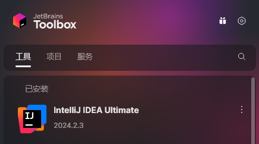

另外说一句，JetBrains 的所有产品都可以使用 [JetBrains Student](https://www.jetbrains.com/student/) 计划免费申请学生许可证，只要使用学信网的在线验证报告即可，强烈建议申请一下正版 IDEA，不然这几天就先用着 30 天的试用版吧。

### MySQL

使用 MySQL 作为数据库，我们换一种方法，不从 MySQL 官方网站下载，而是使用 phpStudy 简化整个过程，你可以从 [phpStudy 官方网站](https://www.xp.cn/php-study) 下载 phpStudy。

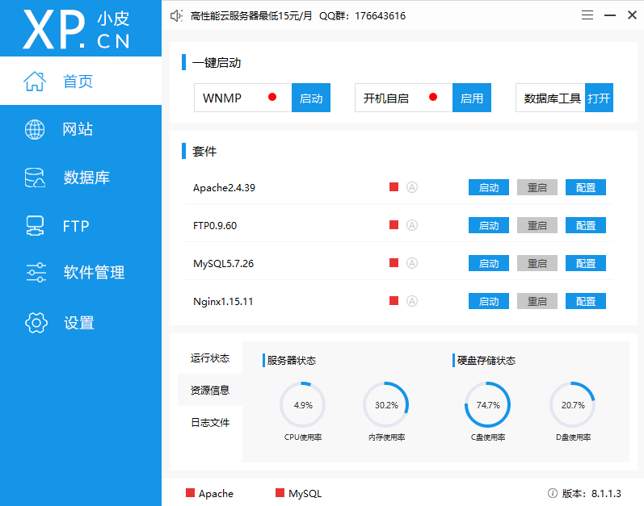

打开后，点击 MySQL，然后点击启动，等待 MySQL 启动完成，此时你的 MySQL 已经在 3306 端口上启动了，MySQL 的用户名和密码都是 `root`。

### Maven

IDEA 自带 Maven，所以无需额外安装，但需要配置一下 Maven 的仓库地址，这里推荐使用阿里云的 Maven 仓库镜像。

### Node.js

大多数人可能是第一次见到 Node.js，我们需要 Node.js 来进行现代化前端开发，你可以从 [Node.js 官方网站](https://nodejs.org/en/) 下载并安装。

顺便使用终端（PowerShell）配置一下 npm 仓库地址，使用淘宝的 npm 镜像。

```bash
npm config set registry https://registry.npmmirror.com
```
### Git（可选）

使用 Git 作为版本控制工具，你可以从 [Git 官方网站](https://git-scm.com/downloads/win) 下载并安装。

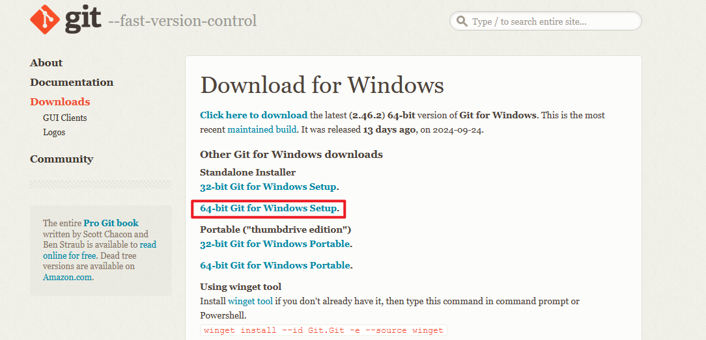

#### GitHub Desktop

使用 GitHub Desktop 作为 GitHub 的图形化客户端（会方便很多），你可以从 [GitHub Desktop 官方网站](https://desktop.github.com/) 下载并安装。

## 立项

任何一个项目都需要一个名字，虽然本仓库的名字是 `dashstar`，但这个起名相当随意，各位可以起一个自己喜欢的名字。但有几点需要注意：

- 项目名称不能包含中文以及任何全角字符
- 只能包含英文字母、数字和下划线，不能包含空格

看到这里，那说明你已经决定了你的项目名字，作为演示，我把我的新项目起名为 `dashstar2`。

### 后端

现在我们打开 IDEA，新建项目，左侧选择 `Jakarta EE`，然后按照图中的指示进行配置。

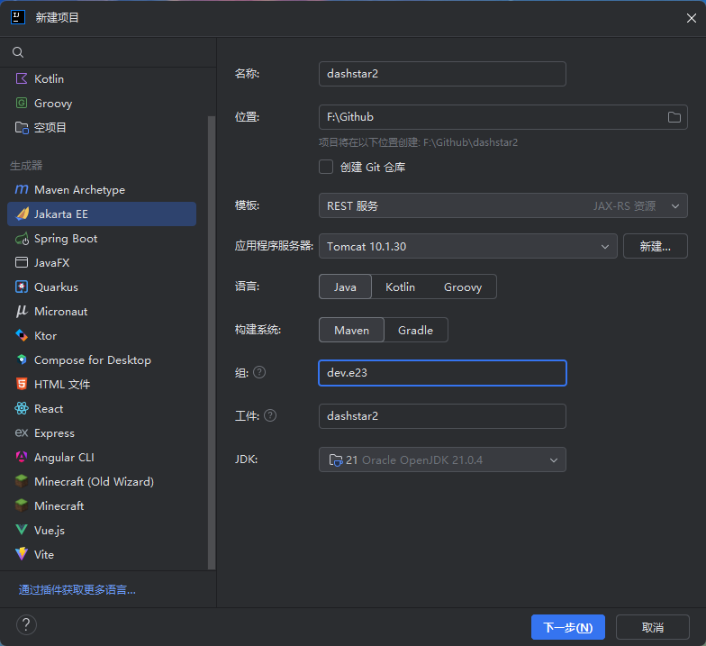

有几个需要关注的点：

- 模板选择 REST 服务（JAX-RS 资源）
- 语言选择 Java
- 构建系统选择 Maven
- 组填写 `com.example` 或者其他什么类似的（比如 `com.baidu`），但是有一个建议，就是组名最好不要使用其他人的组名，举个很简单的例子，如果你使用 `com.baidu` 作为组名，那么你可能会和百度产生冲突，所以这里推荐使用 `com.example` 作为组名。最好的方法是使用 `io.github.<你的 GitHub 用户名>` 作为组名，比如像我就可以使用 `io.github.elabsoak233`。可能你要问，为什么我实际上用的是 `dev.e23`，因为 `e23.dev` 是属于我的域名。
- 工件名与项目名一致

当然，你的应用程序服务器那一栏可能是空的，因为 IDEA 还没有配置 Tomcat，点击右侧的新建按钮，选择 Tomcat 服务器，然后按照下图选择 Tomcat 的地址进行配置。

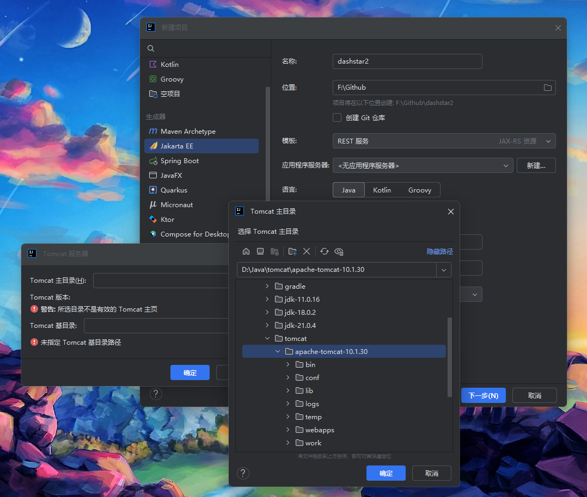

搞定后，点击下一步。规范选择 Web Profile，实现中额外选择 Hibernate 和 Hibernate Validator，然后点击创建。

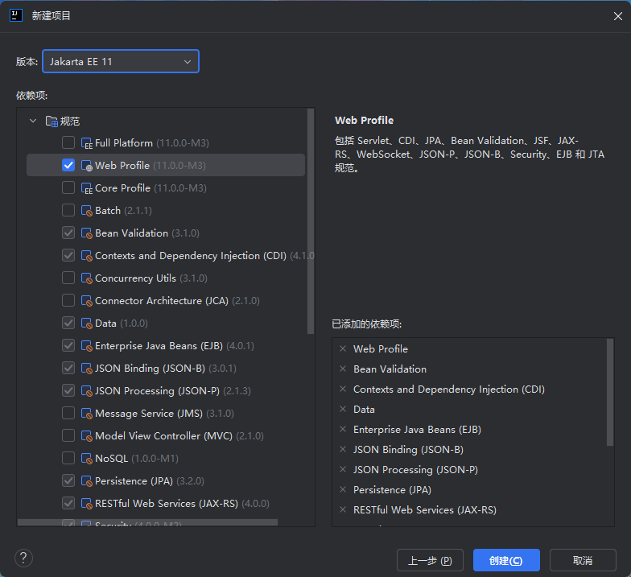

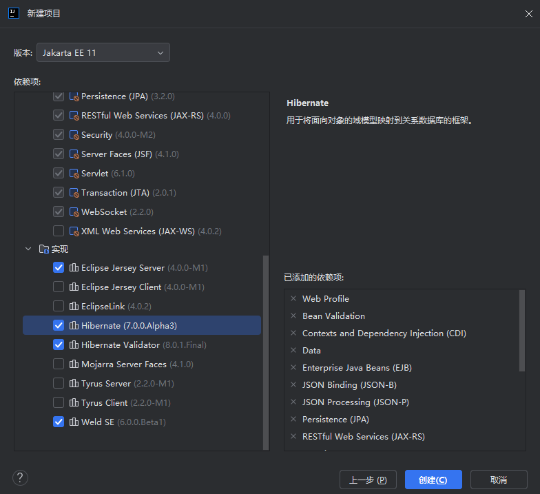

刚创建完的样子基本是这样的

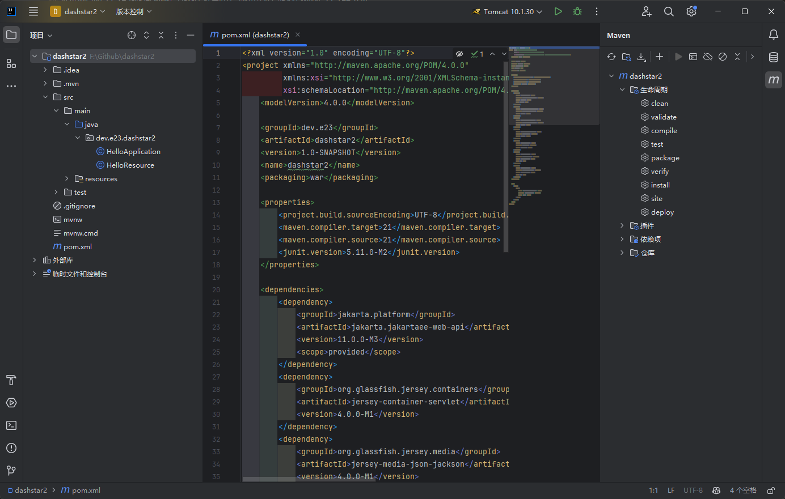

右侧侧边栏有一个 M 图标，这个就是 Maven，当后续修改 `pom.xml` 进行依赖删改时，点击 Maven 的刷新图标，IDEA 就会下载并导入新的依赖。

当然，很多同学在 Maven 拉取依赖的时候会异常慢，此时我们就可以在 `pom.xml` 中为这个项目配置镜像仓库，这里我教大家如何配置阿里云的镜像仓库。

我们打开 `pom.xml`，在 `<project>` 标签下添加如下代码（与 `<dependencies>`、`<properties>` 同级）：

```xml
<repositories>
    <repository>
        <id>aliyun</id>
        <name>AliyunMaven</name>
        <url>https://maven.aliyun.com/repository/public</url>
    </repository>
</repositories>
```

修改完成后，别忘了刷新 Maven。

如果 IDEA 提醒你安装某些插件，建议安装，可以增强你的开发体验

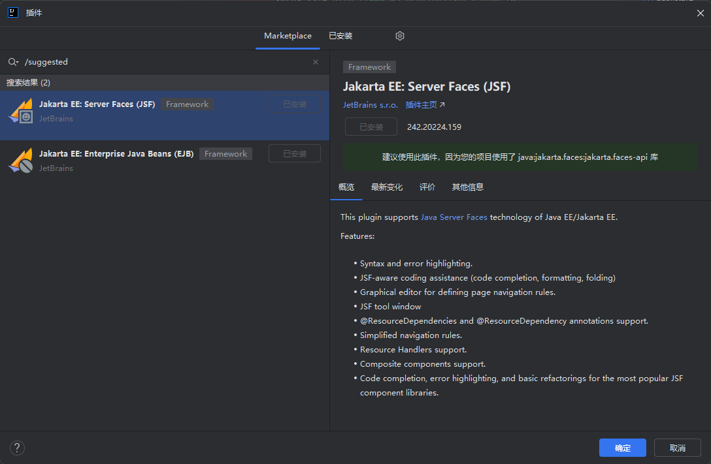

接下来我们配置 Tomcat，点击右上角的 `Tomcat 10.1.30`，点击 `编辑配置...`，按照下图配置项目部署的应用程序上下文为 `/`。

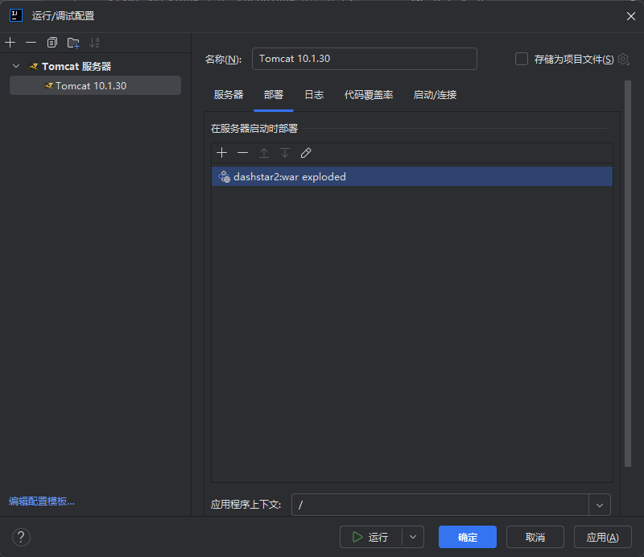

此时点击右上角的绿色三角图标，即可启动项目，启动后 IDEA 会自动打开浏览器，访问 `http://localhost:8080/api/hello-world`，如果看到 `Hello, World!`，那么恭喜你，你的项目已经成功启动了。

顺便我们来检验一下 MySQL 是否能够连接，点击 IDEA 右侧侧边栏的数据库图标，然后点击 `+`，数据源，MySQL，然后按照下图配置。如果你需要下载缺少的驱动文件，直接点击下载即可。用户名和密码都是 `root`，配置完成后点击测试连接，成功后即可点击确定。恭喜你，MySQL 也是能用的了。

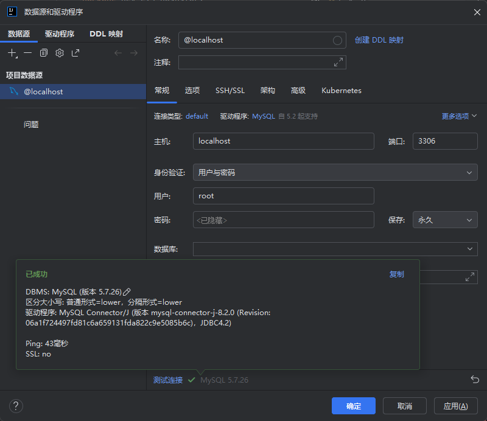

### 前端

在项目根目录中启动终端，运行这条命令，我们将使用 Vite 创建一个 React + Typescript 的项目。

```bash
npm create vite@latest
```

在随后的对话中，按照下面的指示输入或选择，这里给前端项目起名为 web

```bash
√ Project name: ... web
√ Select a framework: » React
√ Select a variant: » TypeScript + SWC
```

然后从终端进入 web 目录

```bash
cd web
```

使用 npm 安装依赖

```bash
npm install
```

与此同时你会发现你的 IDEA 左侧文件夹中多出一个 web 目录，里面存放的就是前端的项目文件

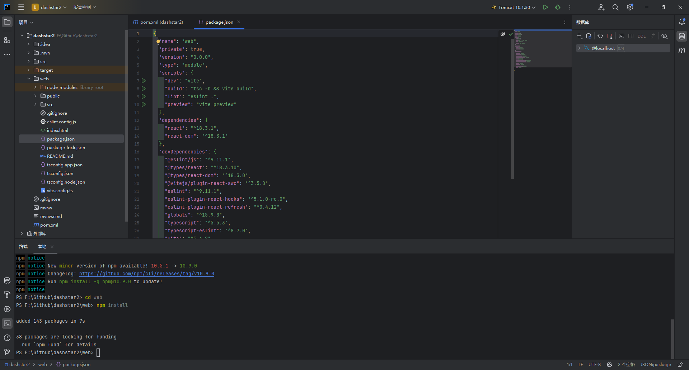

打开 `package.json` 其中 scripts 下的 dev 左侧也有一个启动按钮，点击启动

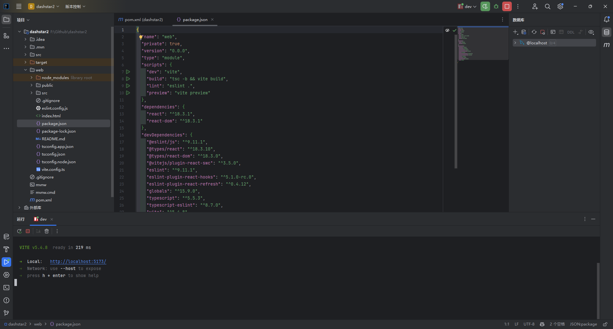

然后你会发现 IDEA 启动了 Vite 前端项目，运行在 `http://localhost:5173`，打开浏览器访问这个地址，如果看到如下界面，那么恭喜你，你的前端项目也成功启动了。

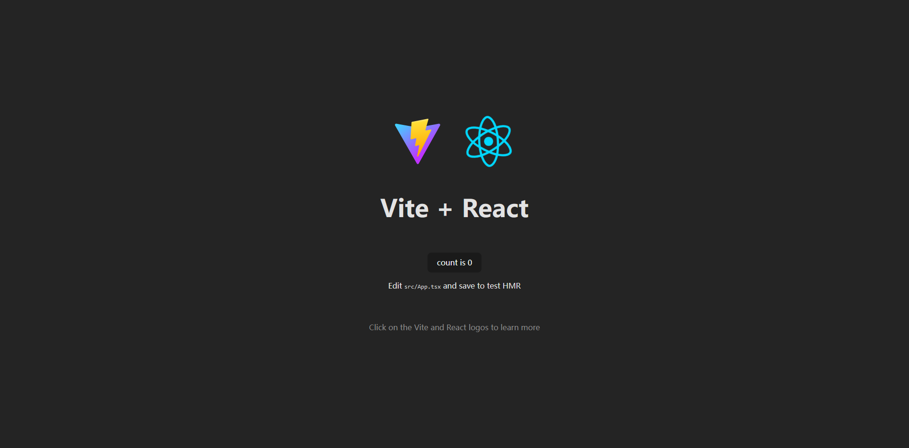

## 开发（后端）

### 模型与持久化

在设计模型前，我们需要思考 **“一个博客系统都有些什么”**，比如，一个博客系统肯定有文章，有用户，文章里面还有评论……

因为我们需要实现的是一个很简单的博客系统，所以我们只需要实现以下这些模型就好了

- 文章（Article）
- 用户（User）
- 评论（Comment）

为什么我们需要模型？ 因为我们需要在数据库中存储各种各样的数据，而模型就是用来描述这些数据的，比如，文章有标题、内容、作者、发布时间等属性，用户有用户名、昵称、密码等属性，评论有评论内容、评论人、评论时间等属性。

通常我们会在工件包下创建一个子包 `model` 来专门存储各类模型，比如我的工件包名是 `dev.e23.dashstar`，那么我的模型包名就是 `dev.e23.dashstar.model`。

你可以在[这里](./src/main/java/dev/e23/dashstar/model)查看所有的模型。着重查看 [`User`](./src/main/java/dev/e23/dashstar/model/User.java) 模型。

如果你直接复制 `User` 的话，可能会报错，最常见的错误就是找不到 `lombok.Data`，因为我们还没有在 `pom.xml` 中添加 Lombok 的依赖。

这里简单解释一下 Lombok，Lombok 是一个 Java 库，它可以帮助我们减少代码的冗余，比如，我们不需要手动编写 getter、setter、toString、equals、hashCode 等方法，只需要在类上加上 `@Data` 注解，Lombok 就会自动生成这些方法。

于是我们在 `pom.xml` 中的 `<dependencies>` 块中添加

```xml
<dependency>
    <groupId>org.projectlombok</groupId>
    <artifactId>lombok</artifactId>
    <version>1.18.34</version>
    <scope>provided</scope>
</dependency>
```

添加完后，不要忘记点击 Maven 的刷新按钮（后文将不会再强调这一点）！

接下来各位可以依照本仓库中的其他模型的代码，自行理解并设计模型，源码中皆给予了尽可能详细的注释。

看到这里，你的模型一定都设计完毕了，但是也仅仅是设计了模型，你还没有给你的应用程序配置数据库呢！（上文配置的数据库仅仅是给 IDEA 用的，你的应用程序并不知道这么一个数据库的存在）。

我们这次的项目使用 Hibernate 作为 ORM 框架，所以我们需要在 `resources/META-INF` 中配置 `persistence.xml` 文件，将数据持久化交给 Hibernate。

你可以直接参考[源文件](./src/main/resources/META-INF/persistence.xml)，里面写了详细的注释。

但是有几点需要注意，首先就是数据库的连接地址

```xml
 <!-- 设置 MySQL 数据库 URL -->
<property name="jakarta.persistence.jdbc.url" value="jdbc:mysql://192.168.206.129:3306/dashstar"/>
```

并不是人人都是像我一样 `192.168.206.129` 是 MySQL 的 Host（因为我用了虚拟机，所以不能使用 `127.0.0.1`），如果你们都是按照上文配置的 MySQL，只需要将地址换成 `127.0.0.1` 即可，端口号仍然保持 `3306`。

还有一点，就是我们虽然在创建项目的时候选择了 Hibernate，但是我们并没有给 Hibernate 配置 MySQL 的驱动，即下面这一行，如果你是直接复制的 `persistence.xml`，可能会报错

```xml
 <!-- 设置 MySQL 驱动 -->
<property name="jakarta.persistence.jdbc.driver" value="com.mysql.cj.jdbc.Driver"/>
```

其实解决方法很简单，只需要在 `pom.xml` 中配置一下 MySQL 的依赖即可，如下

```xml
<dependency>
    <groupId>com.mysql</groupId>
    <artifactId>mysql-connector-j</artifactId>
    <version>8.2.0</version>
</dependency>
```

你的 Hibernate 就已经能感知到你的 MySQL 的存在了，但是还有一条在 `persistence.xml` 中的关键配置，是一种创建数据表的新方法，即使用 Hibernate 的自动迁移功能。这样一来，你就不需要使用 `xxx.sql` 的文件进行数据库初始化。

```xml
<!-- 设置 Hibernate 自动创建数据库表，并且当实体类受到修改时修改表结构 -->
<property name="hibernate.hbm2ddl.auto" value="update"/>
```

还没完，我们需要在工件包中创建一个 `listener` 子包，创建一个新类 `HibernateListener`，写入[这里面](./src/main/java/dev/e23/dashstar/listener/HibernateListener.java)的内容。

然后你会发现，我们用到了一个叫 `HibernateUtil` 的工具类，这个工具是来创建 Hibernate 的 `EntityManagerFactory` 的，并且可以给仓库层分发 `EntityManager`（你一定会用到的）。

此时，你若在右上角通过 Tomcat 启动项目，则会看到 `org.hibernate` 开头的日志。

有了模型还不够，我们需要设计每个模型与数据库交互的方法，这些与数据库交互有关的我们统称仓库层（或者 DAO 层）

通常我们会在工件包下创建一个子包 `repository` 来专门存储各类模型对应的仓库层方法，比如我的工件包名是 `dev.e23.dashstar`，那么我的仓库层包名就是 `dev.e23.dashstar.repository`（当然也可以命名为 `dao`）。

详细的仓库层设计你可以看[这里](./src/main/java/dev/e23/dashstar/repository)。着重查看 [`UserRepository`](./src/main/java/dev/e23/dashstar/repository/UserRepository.java) 的设计，其他都是触类旁通。

### 鉴权与过滤器

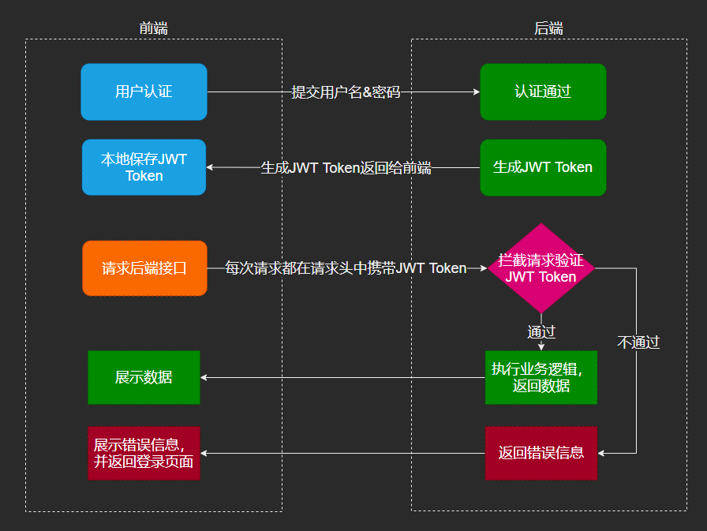

> 什么是 JWT？
> 
> JWT（JSON Web Token）是一个开放标准（RFC 7519），它定义了一种紧凑且自包含的方式，用于在各方之间以JSON对象的形式安全地传输信息。由于它的紧凑和自包含特性，JWT常用于身份验证和信息交换的场景。
> 
> 简单来说，就是一个能足矣确定携带某条 JWT 的请求属于某个用户，且能保证确实是这个用户。如果你想要看看 JWT 到底长啥样，可以在[这个网站](https://jwt.io/)观察一下。

上图就是大部分 Web 应用程序对登录与鉴权的处理，通常 **拦截请求验证 JWT Token** 是放在 **过滤器** 中的，也算是一种中间件。可以理解为，所有的请求在被真正处理之前，会先被过滤器处理。

为了方便起见，我们就将所有与鉴权中间件相关的内容放在 `security` 包下。

你可以在[这里](./src/main/java/dev/e23/dashstar/security/AuthenticationFilter.java)查看过滤器 `AuthenticationFilter` 的实现。

并且我们还需要一个 `@Secured` 注解（注意是注解，不是注释，注解是可编程的），用来注解在需要鉴权的控制器上（在讲控制器之前，你可以把控制器理解为请求进来时经过的方法）。你可以在[这里](./src/main/java/dev/e23/dashstar/security/Secured.java)查看 `@Secured` 注解的定义，定义其实没什么实际含义，真正的逻辑已经写在 `AuthenticationFilter` 的 `extractRoles` 方法中了。

当然还有需要注意的点，就是我们想要使用 JWT，但我们并没有添加 JWT 相关的依赖，所以，别忘了添加下面几条（这里使用 JJWT）

```xml
<dependency>
    <groupId>io.jsonwebtoken</groupId>
    <artifactId>jjwt-api</artifactId>
    <version>0.11.5</version>
</dependency>
<dependency>
    <groupId>io.jsonwebtoken</groupId>
    <artifactId>jjwt-impl</artifactId>
    <version>0.11.5</version>
    <scope>runtime</scope>
</dependency>
<dependency>
    <groupId>io.jsonwebtoken</groupId>
    <artifactId>jjwt-jackson</artifactId>
    <version>0.11.5</version>
</dependency>
<dependency>
    <groupId>com.fasterxml.jackson.module</groupId>
    <artifactId>jackson-module-jaxb-annotations</artifactId>
    <version>2.18.0</version>
</dependency>
```

### 业务与 REST 控制器

> 什么是业务？
> 
> 在软件开发中，“业务”通常指的是应用程序的核心功能和逻辑，这些功能和逻辑直接与实现应用程序的目标相关。业务逻辑涉及处理数据、执行计算、应用规则以及确保数据完整性和一致性的代码。
> 
> 简单来说，就是你的应用程序要实现什么功能。

> 什么是 REST 控制器？
> 
> REST 控制器是遵循 REST（Representational State Transfer）架构风格的 Web 应用程序中的一个组件，它负责处理传入的 HTTP 请求并将它们映射到相应的业务逻辑处理上。
> 
> 简单来说，就是你的应用程序的接口，外面的请求只能通过这些接口来使用你的业务。而 REST 则是一种要求，要求我们将所有的接口都按照 **资源** 进行分类，资源可以简单地理解为我们所定义的模型们。

通常我们写业务层和控制层的时候，需要两个包，一个叫 `service`，一个叫 `controller`，但这一次，为了方便教学和理解，我们只采用一个层就完成两个层需要做的工作，我给这个包命名为 `handler`，你可以在[这里](./src/main/java/dev/e23/dashstar/handler)查看所有的 `handler`。

具体的代码实现，我都在源码中以注释的形式描述清楚了，下面讲解的是设计思路。

#### 用户

我们思考一下，与用户（这里说的是用户这个模型，不是真正的用户）直接相关的操作（尽可能往少但是必要的想），是不是就下面这些？

- 登录（Login）
- 注册（Register）
- 获取所有用户信息（GetAllUsers）
- 获取指定 ID 用户的信息（GetUserById）

具体的解释，请务必到[源码](./src/main/java/dev/e23/dashstar/handler/UserHandler.java)中查看，有代码才能方便理解！

但在这里还要多提一句，就是有关密码，即 `User` 模型的 `password` 字段，我们不能明文存储用户的密码，你可以用 SHA256、MD5 等等进行加密，但其实有一个专门用于加密密码的算法，叫做 `BCrypt`，在 `UserHandler` 中对密码进行处理时，我们引用了 jbcrypt 库，所以你要添加依赖

```xml
<dependency>
    <groupId>org.mindrot</groupId>
    <artifactId>jbcrypt</artifactId>
    <version>0.4</version>
</dependency>
```

#### 文章

- 获取所有文章（GetAllArticles）
- 获取指定 ID 的文章（GetArticleById）
- 创建文章（CreateArticle）
- *获取指定 ID 的文章的附属评论（GetComments）*

#### 评论

- 创建评论（CreateComment）

这里一起讲解一下文章和评论的设计，上方有一个标注了斜体的方法，它是通过文章 ID 获得指定文章的所有评论，那么问题在于，按照 REST 的设计理念，它到底应该被归为文章，还是应该被归为评论呢？

答案是不确定的，因为你可以这样获得指定文章的评论（如上所述）`GET /api/articles/{id}/comments`，当然你也可以像这样获得 `GET /api/comments?article_id={id}`，所以说，这个问题它没有固定答案，不论你将这个方法归属在哪个资源（文章、评论）下，它都是正确的。

但你也看见了，在这里，我愿意将这个方法归属于文章资源。

## 开发（前端）

## 附录

### 附加题

- 仔细观察有关用户的输出，真的应该携带密码的哈希值吗？如果我不想携带密码哈希值输出，请问我该怎么办？（+5）
- 身为管理员，竟然不能删除评论，万一别人评论了不好的话怎么办？（+10）
- 文章太多了，一个页面（首页）如果显示全部的文章，不仅看上去不美观，性能也会大打折扣。请问使用什么方法解决这个问题？ （+10）
- 一个成熟的博客应该有一个分类系统，或者标签系统，这样能够帮助用户快速检索想看的文章，请问你能够在此基础上设计出一个标签或者分类系统吗？（+15）
- 前端太素了，能不能好看一点？（需要你自行设计页面，这涉及很多内容，React 和 Mui 都需要点理解，当然，如果你足够强的话，可以把前端推翻重来）（+15）

### 小技巧

如果你实在觉得跟着教程做难度很大，不妨试试看直接克隆整个代码仓库，然后自己想方法跑起来。